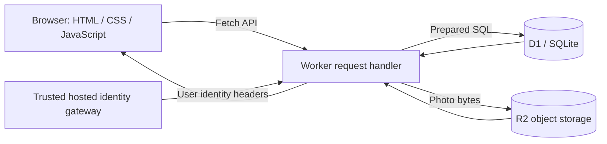

# InstaX architecture

## Purpose

InstaX is a social application with photo/text posts, profiles, follows, replies, private bookmarks, and an activity inbox. It uses a small browser frontend and a Fetch-compatible JavaScript backend. The current user preview runs locally; hosted publishing has not been completed.

## Request flow

Local development uses the same Worker module with SQLite and filesystem adapters. Local sign-in is a development simulation, not an independently implemented production authentication provider. The hosted design depends on the gateway stripping spoofed identity headers and enforcing access policy.

## Data model

| Table | Responsibility | Integrity constraints |
|---|---|---|
| profiles | Display name, unique handle, bio, avatar object key | Primary user ID, unique handle |
| posts | Text, photo key, author, timestamp | Author foreign key |
| likes | User/post relation | Composite primary key; cascading post deletion |
| comments | Replies with author and timestamp | User/post foreign keys; cascading post deletion |
| follows | Directed user relationships | Composite primary key |
| bookmarks | Private saved-post relationships | Composite primary key; cascading post deletion |
| notifications | Recipient, actor, event type, post, read state | Recipient indexes; cascading post deletion |

Drizzle generates versioned migrations. Existing migrations remain immutable. Preview migrations are applied once and tracked in the local database.

## Decisions worth discussing in an interview

### Atomic activity events

Likes, comments, and follows save their notification in the same database batch as the underlying action. If the notification insert fails, the action rolls back. Deterministic notification IDs prevent repeated likes/follows from creating duplicate events. Self-interactions do not create notifications. Unlike/unfollow removes the associated notification.

### Private saved posts

Bookmarks are always filtered using the server-authenticated user ID. The browser cannot choose another user's saved collection. Saved state is returned per viewer, and deleting a post cascades to its bookmarks.

### Stable pagination

The feed uses a `(created, id)` cursor rather than row offsets. The ID resolves timestamp ties, avoiding skipped records when several posts share the same millisecond. New inserts do not shift an offset between page requests. Following, search, profiles, and saved posts use chronological order. For you uses an explainable heuristic recommender, described below.

### Media lifecycle

Post photos and avatars live in object storage; SQL stores their keys. Uploads have size/type checks, and the server verifies file signatures. Failed database writes remove newly uploaded objects. Replacing an avatar removes the previous object; deleting a post removes its image. SQL and object storage are separate systems, so cleanup is compensating work rather than a cross-system transaction. Production use would benefit from retryable cleanup jobs and orphan reconciliation.

### Browser behavior

User-generated text is escaped before HTML insertion. The browser uses native forms/dialogs, keyboard-operable controls, a skip link, and responsive navigation. Requests are sequenced so a stale feed response cannot replace newer navigation. Failed saves preserve drafts. A feature-detected WebMCP search tool reuses the visible feed/search path.

## Verification

`node scripts/build-orbit.mjs` builds the Worker, assets, and migrations. `node tests/backend.mjs` exercises the Worker against isolated in-memory SQLite and object-storage adapters. Tests cover:

- ownership and authentication checks;
- cross-origin write rejection;
- post/image/profile persistence and input validation;
- avatar replacement and cleanup;
- viewer-specific bookmarks and notifications;
- duplicate event suppression and read-state isolation;
- notification failure rollback using a deliberately failing SQL trigger;
- 35 equal-timestamp records across two cursor pages;
- cascading deletion cleanup.

The GitHub Actions workflow runs syntax, build, and integration checks on Node 24 for pushes and pull requests. It is configured locally; a successful hosted CI run has not yet been observed.

## Production gaps and next steps

This is a portfolio application, not a claim of production scale. No load-test or real-user metrics are claimed. Before an unrestricted public launch: complete hosted authentication/deployment checks, add per-user abuse limits, reporting/moderation, storage quotas, upload decoding/resizing, monitoring, backups, and durable failed-cleanup retries. Activity updates on navigation or Refresh; it is not a real-time push service. The inbox shows the most recent 100 events. Search uses bounded substring queries and is suitable for this demo, not a replacement for a full-text search index.

## For you recommendations

The backend ranks the latest 200 posts with freshness, capped engagement, followed-author boosts, and hashtag overlap from the current user's latest 100 liked/saved posts. Already-liked or saved content receives a small penalty to promote discovery. Each post includes a reason. The client sends displayed IDs when loading more, avoiding duplicates as scores change. This bounded heuristic uses no machine-learning model and does not promise an immutable snapshot across pages. See README for the weights and regression checks.

